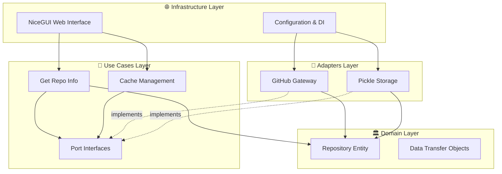

[← Previous: Use Case](03-use-case.md) | [Next: Data Collection →](05-data-collection.md)

---

# Architecture Overview

## Clean Architecture (Hexagonal / Ports & Adapters)

## Key Benefits
✅ **Testability** - Easy to mock dependencies  
✅ **Maintainability** - Clear separation of concerns  
✅ **Flexibility** - Swap implementations without breaking logic  
✅ **Dependency Inversion** - Core logic isolated from frameworks  

---

[↑ Back to Top](#architecture-overview)