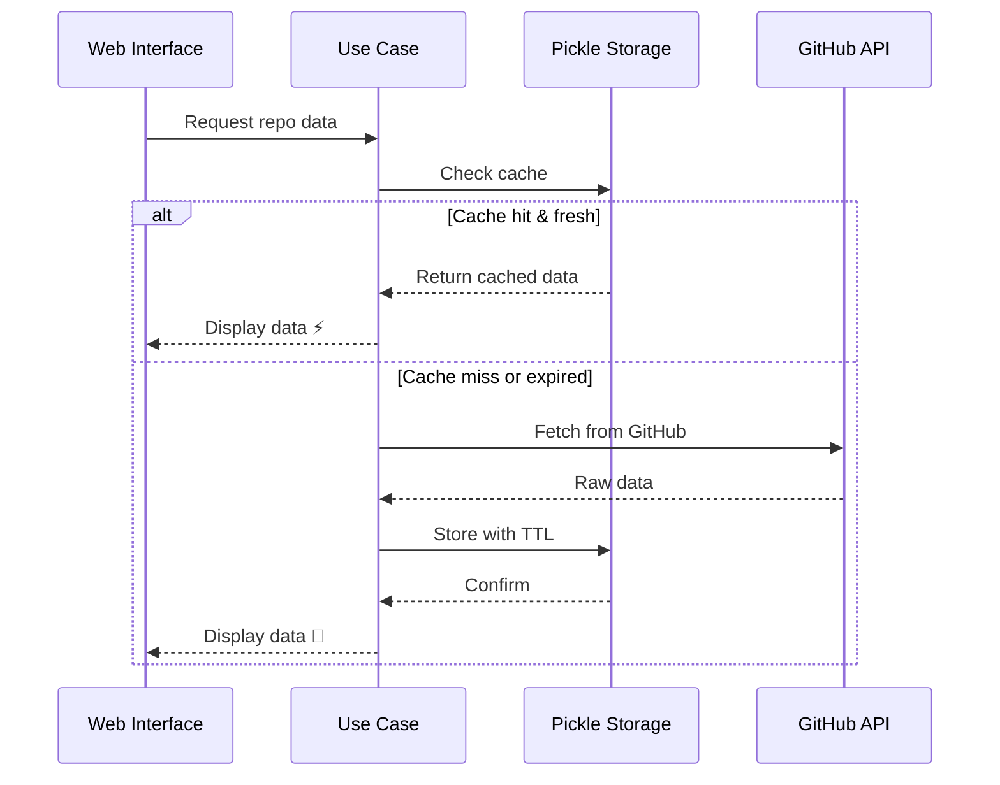

[← Previous: Rate Limits](06-rate-limits.md) | [Next: Data Processing →](08-data-processing.md)

---

# Data Storage & Caching Strategy

## Pickle File Storage with TTL

```
.storage/
└── repo_info.pickle
    ├── Repository data
    ├── Timestamp (created_at)
    └── TTL: 24 hours (default)
```

## How It Works



## Configuration

```bash
# .env
STORAGE_FOLDER=.storage/
CACHE_TTL_SECONDS=86400  # 24 hours
```

## Benefits
✅ **Performance**: Subsequent requests = instant  
✅ **API Efficiency**: 83x fewer requests after initial fetch  
✅ **User Experience**: No waiting for cached data  
✅ **Configurable**: Adjust TTL based on needs  

---

[↑ Back to Top](#data-storage--caching-strategy)