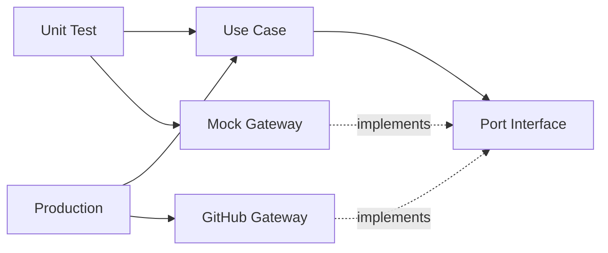

[← Previous: Data Processing](08-data-processing.md) | [Next: Summary View →](10-viz-summary.md)

---

# Analysis Implementation

## Two Core Use Cases

### 1. GetRepoInfoBySource
**Purpose**: Fetch repository data (cache-first strategy)

```python
class GetRepoInfoBySourceUseCase:
    def __init__(
        self,
        gateway_selector: Aggregate[RepoPort],
        storage: RepoInfoStorage,
        time_to_live_seconds: int = 60 * 60,
    ):
        self.__selector = gateway_selector
        self.__storage = storage
        self.__ttl = time_to_live_seconds

    async def execute(
        self, source: dto.RepoSourceEntity
    ) -> entities.RepoInfoEntity:
        # 1. Check cache first
        if db_item := await self.__get_from_db(source):
            return db_item

        # 2. Fetch from GitHub API if cache miss/expired
        gateway_item = await self.__get_from_gateway(source)

        # 3. Store in cache for future requests
        create_item = schemas.CreateRepoInfoSchema(**gateway_item.model_dump())
        new_item = await self.__storage.create_one(create_item)
        return new_item
```

**Location**: `app/use_cases/get_repo_info_by_source.py`

---

### 2. GetRepoInfoById
**Purpose**: Retrieve multiple repositories by ID from cache

```python
class GetRepoInfoByIdUseCase:
    def __init__(self, storage: RepoInfoStorage):
        self.__storage = storage

    async def execute(self, ids_list: list[int]) -> list[RepoInfoEntity]:
        # Remove duplicates
        id_set = set(ids_list)

        # Fetch each repository from storage
        items_list = []
        for id in id_set:
            if item := await self.__storage.get_one(id):
                items_list.append(item)

        return items_list
```

**Location**: `app/use_cases/get_repo_info_by_id.py`

---

## Dependency Injection Benefits



**Testability**: Swap real gateway for mock in tests  
**Flexibility**: Add GitLab gateway without changing use case  
**Maintainability**: Clear separation between business logic and infrastructure  

---

[↑ Back to Top](#analysis-implementation)