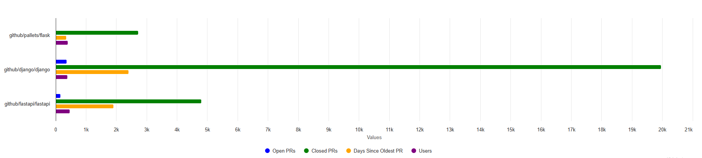
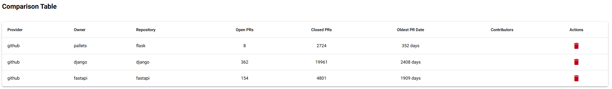
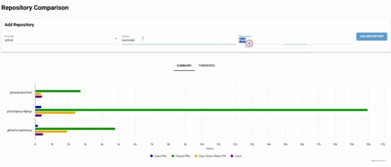

[← Previous: Analysis](09-analysis.md) | [Next: Time Series →](11-viz-timeseries.md)

---

# Visualization: Summary View

## Repository Comparison

---

## Key Features

### 📊 Horizontal Bar Chart
- **Blue**: Open Pull Requests
- **Green**: Closed Pull Requests
- **Orange**: Days Since Oldest PR
- **Purple**: Contributors Count

### 📋 Comparison Table
Detailed metrics in tabular format:
- Provider (GitHub, GitLab, etc.)
- Owner & Repository name
- Exact counts for each metric
- Action buttons (remove repository)

---

## User Interaction

  

**Add Repository**:
1. Select provider (GitHub)
2. Enter owner & repository name
3. Click "Add Repository"
4. Data fetches in background
5. Chart updates automatically

**Remove Repository**:
- Click red delete button in table
- Instant removal from comparison

---

## Insights at a Glance

**Example**: Comparing similar projects
- Compare metrics side-by-side
- Identify patterns in PR management
- Assess community size and activity
- Understand project health at a glance

---

[↑ Back to Top](#visualization-summary-view)
