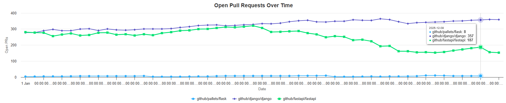
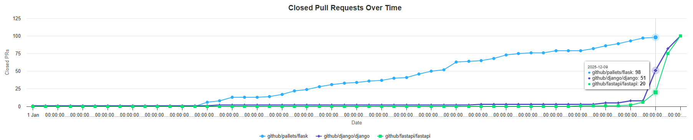
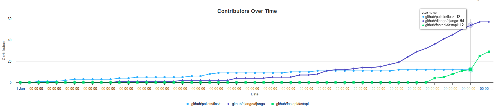

[← Previous: Summary View](10-viz-summary.md) | [Next: Insights →](12-insights.md)

---

# Visualization: Time Series Analysis

## Temporal Trends Over 1 Year

---

## Two Coordinated Charts

### 📈 Open Pull Requests Over Time
- **Y-axis**: Count of open PRs
- **X-axis**: Date (1-year window)
- **Pattern**: Shows accumulation of open issues

### 📉 Closed Pull Requests Over Time
- **Y-axis**: Count of closed PRs
- **X-axis**: Date (1-year window)
- **Pattern**: Shows maintenance activity

---

## Multi-Repository Comparison

**Different colors** for each repository displayed on the same chart
- Enables direct visual comparison of trends
- Helps identify growth patterns
- Shows project activity over time

---

## Current Limitations

### X-Axis Readability
- **Issue**: Date labels on X-axis are difficult to read
- **Cause**: Fixed chart width + 1-year date range = compressed labels
- **Impact**: Users must zoom in or hover to see specific dates clearly

---

## Trend Analysis Patterns

### Healthy Project Pattern
→ Open PRs steady or declining, Closed PRs increasing
→ Maintainers keeping up with contributions

### Stressed Project Pattern
→ Open PRs rapidly increasing, Closed PRs stagnant
→ Contributions outpacing review capacity

### External Issues Pattern
→ Oscillating open PRs, unusual closed PR jumps
→ Not using GitHub issues → atypical patterns

---

## Toggle Between Views

  <video controls loop muted autoplay style="max-width: 100%; height: auto;">
    <source src="../.assets/add-repo.mp4" type="video/mp4">
    Your browser does not support the video tag.
  </video>

**Summary** ↔️ **Time Series** tabs for different perspectives

---

[↑ Back to Top](#visualization-time-series-analysis)