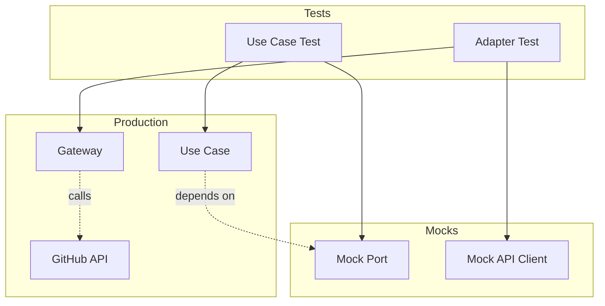

[← Previous: Insights](12-insights.md) | [Next: Conclusion →](14-conclusion.md)

---

# Testing Strategy

## Testing Approach

### Three-Pillar Strategy

1. **Fixtures for Data Factories**
   - Polyfactory generates realistic test data
   - Reusable across multiple tests
   - Reduces test data duplication

2. **Mocks for Interfaces & Implementations**
   - Mock port interfaces (RepoPort, StoragePort)
   - Mock external dependencies (GitHub API client)
   - Enables isolated unit testing

3. **Dependency Injection in Tests**
   - Classes receive mocked dependencies when necessary
   - Follows same patterns as production code
   - Clear separation of concerns

---

## Test Organization
```
tests/
├── conftest.py              # Pytest configuration
├── fixtures/                # Data factories (Polyfactory)
│   ├── entity_factories.py  # Domain entity factories
│   ├── dto_factories.py     # DTO factories
│   └── schema_factories.py  # Schema factories
├── mocks/                   # Mock interfaces & implementations
│   ├── gateway_mocks.py     # Mock RepoPort
│   ├── storage_mocks.py     # Mock StoragePort
│   └── use_case_mocks.py    # Mock use cases
└── unit/                    # Tests organized by layer
    ├── adapters/
    ├── domain/
    └── use_cases/
```

---

## Real Test Example: Cache Hit Scenario

```python
@pytest.mark.asyncio
async def test_execute_returns_from_storage_when_cache_valid(
    use_case: GetRepoInfoBySourceUseCase,
    mock_gateway: AsyncMock,
    mock_storage: AsyncMock,
):
    """Test that use case returns from storage when cache is valid."""

    # 1. Arrange: Set up test data and mocks
    source = dto.RepoSourceEntity(
        provider="github", owner="test_owner", repo="test_repo"
    )
    cached_entity = entities.RepoInfoEntity(
        id=2,
        provider="github",
        owner="test_owner",
        repo="test_repo",
        open_prs_count=15,
        closed_prs_count=25,
        oldest_pr=datetime(2024, 1, 1),
        users_count=8,
        open_prs=[],
        closed_prs=[],
        users=[],
        created_at=datetime.now(),
        updated_at=datetime.now(),
    )
    mock_storage.get_many.return_value = [cached_entity]

    # 2. Act: Execute the code under test
    result = await use_case.execute(source)

    # 3. Assert: Verify the results
    assert result == cached_entity
    mock_storage.get_many.assert_called_once()
    mock_gateway.get_open_pull_requests_count.assert_not_called()
    mock_storage.create_one.assert_not_called()
```

**Location**: `tests/unit/use_cases/test_get_repo_info_by_source.py`

**What this tests**: Cached data is returned without calling GitHub API

---

## Test Data Generation with Polyfactory

```python
from polyfactory.factories.pydantic_factory import ModelFactory
from app.domain.entities import RepoInfoEntity

class RepoInfoFactory(ModelFactory[RepoInfoEntity]):
    """Generate realistic test data automatically"""
    __model__ = RepoInfoEntity

# Usage in tests
def test_something(repo_info_factory):
    # Generate test data with specific values
    repo = repo_info_factory.build(
        open_prs=42,
        closed_prs=100
    )
    assert repo.open_prs == 42
```

---

## Clean Architecture Testing Benefits



✅ **Isolation**: Test each layer independently  
✅ **Speed**: No real API calls in tests  
✅ **Reliability**: No network dependencies  
✅ **Coverage**: Easy to test edge cases  

---

## Test Execution

```bash
# Run all tests with coverage
uv run pytest --cov

# Run specific test layer
uv run pytest tests/unit/use_cases/

# Run with verbose output
uv run pytest -v
```

---

[↑ Back to Top](#testing-strategy)
